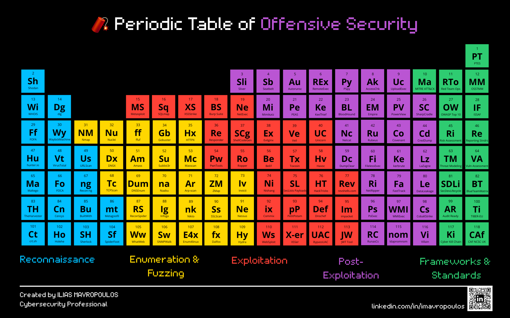

# 🧨 Periodic Table of Offensive Security

A visual reference of **118 essential tools, frameworks, and standards** used in offensive security and red teaming, organized like a periodic table.

## 📄 Download

🎯 **[Download Printable PDF](./periodic_table_offsec_print.pdf)**

Use this print quality PDF with CMYK profile if you want to bring the periodic table to life.

🎯 **[Download Printable PDF in Light/printer friendly "mode"](./periodic_table_offsec_print_white.pdf)**

Use this print quality PDF for quick eco-printing at home. 

🔗 [View Clickable PDF (Full Screen)](https://straw-hat-hacks.github.io/periodic-table-offensive-security/clickable.html)

Each element tile is clickable and redirects to the corresponding tool/resource.
🔹 Note: Clickable version is best viewed on desktop. Most mobile PDF viewers (especially in iOS) do not support clickable areas properly.

---

## 🔍 Categories

- 🔷 **Reconnaissance** – OSINT, asset discovery, intel tools
- 🟨 **Enumeration & Fuzzing** – DNS, web, and network discovery
- 🟥 **Exploitation** – Payloads, injections, bypasses, phishing
- 🟪 **Post-Exploitation** – Credential abuse, pivoting, persistence
- 🟩 **Frameworks & Standards** – Methodologies and governance

---

## 📚 Use Cases

- Penetration Testing / Red Teaming Training & Mentorship
- Actual Offensive Security operations
- Pentest / engagement prep  
- OSINT and recon reference  
- Visual companion to MITRE ATT&CK  
- Teaching tool/guideline for cybersecurity students

---

## 🧠 Created by

**Ilias Mavropoulos** – Cybersecurity Professional  
🔗 [linkedin.com/in/imavropoulos](https://linkedin.com/in/imavropoulos)

---

## 📬 Contribute

Want to suggest a tool change, addition, or replacement?

📝 Edit the [`periodic-table-tools.md`](./periodic-table-tools.md) file and submit a Pull Request (PR).

You can also:
- Open an **Issue** to start a discussion
- Join the **Discussions** tab for ideas, feedback, and feature requests

💡 See the [How to Contribute](https://github.com/Straw-Hat-Hacks/periodic-table-offensive-security/wiki/How-to-Contribute) page in the Wiki for detailed guidelines.

💬 Join the conversation in [Discussions](https://github.com/Straw-Hat-Hacks/periodic-table-offensive-security/discussions)

---

## 📜 License

Released under the [MIT License](./LICENSE) – free to use with credit.

---

## 📦 Legacy Versions

Archived visuals from older releases are available in the [`/legacy`](./legacy) folder.

