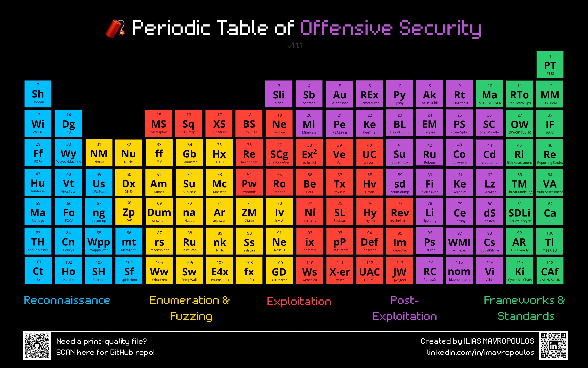

# 🧨 Periodic Table of Offensive Security

A visual reference of **118 essential tools, frameworks, and standards** used in offensive security and red teaming — organized like a periodic table.

## 📄 Download

🎯 **[Download Clickable PDF](./periodic_table_offsec.pdf)**  
Each tile links directly to official documentation, GitHub pages, or tool references.

---

## 🔍 Categories

- 🔷 **Reconnaissance** – OSINT, asset discovery, intel tools
- 🟨 **Enumeration & Fuzzing** – DNS, web, and network discovery
- 🟥 **Exploitation** – Payloads, injections, bypasses, phishing
- 🟪 **Post-Exploitation** – Credential abuse, pivoting, persistence
- 🟩 **Frameworks & Standards** – Methodologies and governance

---

## 📚 Use Cases

- Penetration Testing / Red Teaming Training & Mentorship
- Actual Offensive Security operations
- Pentest / engagement prep  
- OSINT and recon reference  
- Visual companion to MITRE ATT&CK  
- Teaching tool/guideline for cybersecurity students

---

## 🧠 Created by

**Ilias Mavropoulos** – Cybersecurity Professional  
🔗 [linkedin.com/in/imavropoulos](https://linkedin.com/in/imavropoulos)

---

## 📬 Contribute

Want to add links or suggest a tool? Open an issue or PR!

---

## 📜 License

Released under the [MIT License](./LICENSE) – free to use with credit.
